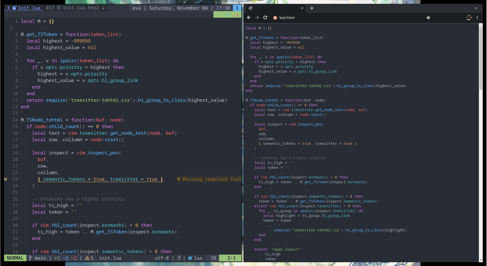

# treesitter-tohtml.nvim

> [!WARNING]
> Really incomplete , barely functional.

---

Generate HTML from code using treesitter tree.
Just like vim `:TOHtml` but supporting Treesitter + LSP syntax highlighting.

All Highlights are made into CSS Variables (following highlight links) so they can be easily customized using browser dev tools.

## Commands

`:TSTOHtml`: Creates a new buffer with the generated HTML.

## Config

no config for now!
